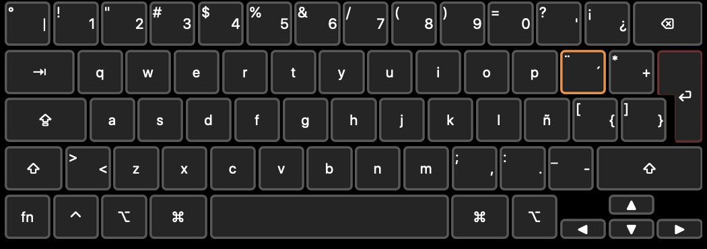

# Configure Corne Keyboard

> These are the configuration files to flash the corne keyboard.
>
> The compilation and flash of the keyboard can be made using the [**qmk**](https://docs.qmk.fm/newbs_building_firmware) tool.
>
> ## Keyboard layout
>
>> This configuration is made to operate with an ISO keyboard on macos.
>>
>> There's a strange configuration with the key codes 0x0035 and 0x0064, they look like they're inverted but they work just fine.
>>
>> Here's the keyboard layout that it's designed for:
>>
>> 